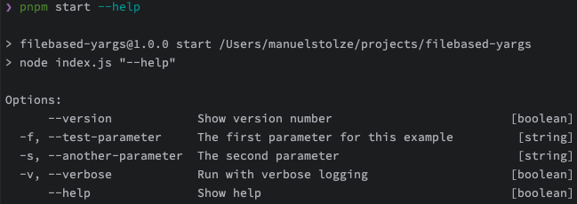

# README

This project is a simple CLI tool that reads a YAML file and prints the content to the console. It uses `yargs` for parsing the command line arguments and `js-yaml` for parsing the YAML file.

## Getting Started

First, install the dependencies:

```bash
npm install
```

## Usage

The `YargsLoader` class is used to load yargs options from a YAML file. Here is a small example of how to use it:

```javascript
const path = require("path");
const YargsLoader = require("./src/yargs-loader/YargsLoader");

const OPTION_FILE_PATH = path.join(__dirname, "/config/yargs-options.yaml");

function main() {
    const yargsLoader = new YargsLoader(OPTION_FILE_PATH);
    console.log(yargsLoader.options);
}

if (require.main === module) {
    main();
}
```

In the above example, `YargsLoader` is initialized with the path to a YAML file that contains the yargs options. The options are then accessible through the `options` property of the `YargsLoader` instance.

The YAML file should be structured like this:

```yaml
option-name:
  description: "Option description"
  type: "Option type"
  alias: "Option alias"
```

For example:

```yaml
test-parameter:
  description: "The first parameter for this example"
  type: "string"
  alias: "f"
another-parameter:
  description: "The second parameter"
  type: "string"
  alias: "s"
```

In this example, two options are defined: `test-parameter` and `another-parameter`. Each option has a description, a type, and an alias.

To run the script with these options, use the following command:

```bash
node index.js --test-parameter value1 --another-parameter value2
```

Or using the aliases:

```bash
node index.js -f value1 -s value2
```

This will print the parsed options to the console.

## Help Parameter

The `YargsLoader` class also supports a `help` parameter that can be used to print the help message for the options defined in the YAML file. 

```bash
node index.js --help
```

This leads to the following output:

